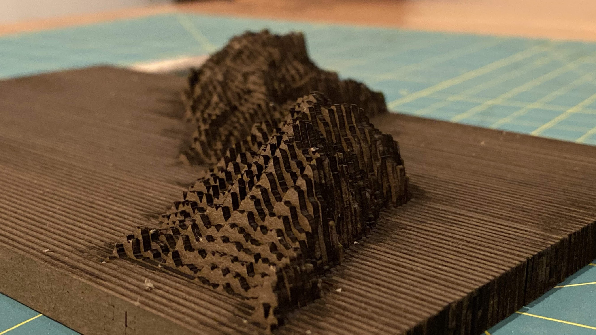

# Forked version of https://github.com/dps/laserUp to generate SVGs for laser or CNC cutting.

🙏 to dps for the amazing work, this is a quick hack on top. See https://github.com/dps/laserUp for their python implementation. 

# 🏔laserUp: SVG Relief Map Generator
create 3D relief maps for laser cutting.

See https://github.com/dps/peak-map for a UI to generate the raw input data (hosted here: http://singleton.io/peak-map )

## Usage
Go to https://singleton.io/peak-map/ and download the raw data file. Move and zoom to the area you want to generate a relief map for. Click "Draw peaks" and then "Get data for laserUp". This generates a .DMS file.

Go to https://github.com/trivisonno/laserUp-js/. Select your .DMS file. Adjust the material thickness (the thickness of each slice) and max design height (the maximum height of the map). Click "Generate SVGs". This generates a zip file with SVG files for each row of the map.

You can then use the SVG files to cut each slice of your relief map using the program and tools of your choice.

